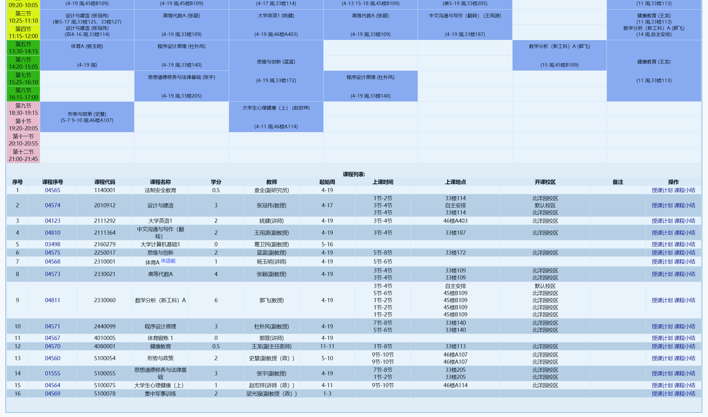

# 大一上

### 课表

### 注意事项

1. 设计与建造是一个特别离谱的项目制课程：主要内容造小车，重点在于写好每次的文档
2. 思维与创新：一个比较神奇的课程，培养思维能力。有几次小组展示或者辩论。需要写一片论文
3. 高等代数：高等代数，b站搜索丘维声 [🔗传送门](https://www.bilibili.com/video/BV1jR4y1M78W/) 可以考虑购买配套书籍（孙笑涛讲义太抽象）
4. 数学分析：很好的老师，加强高数
5. 程序设计原理：b王du pu feng，据说b站的视频比较好（关键词：小杜老师）。如果有基础可以考虑不用听
6. 形势与政策、大学英语、思修：公共课，考前请认真复习
   1. 形势与政策：没有考试，线上答题
   2. 大学英语：背单词，书后题，U校园，批改网 认真完成即可
   3. 思修：考前务必复习，不然论述材料题啥也不会。重点张宇老师比较好，网上流传版本比较多，注意甄别

# 大一下

